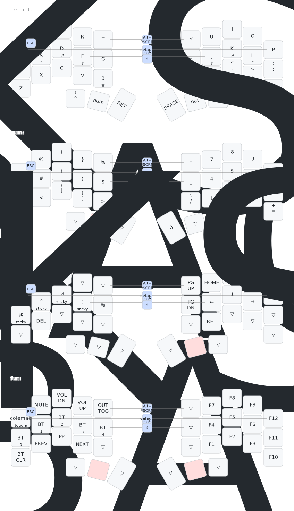

# Bad Temper ZMK Config

This is my hack of a ZMK config for the [Bad Temper](https://github.com/essFitt/Bad-Temper) by [EssFit](https://github.com/essFitt).

Some notes about this config:
- Original Bad Temper board and [ZMK Repo](https://github.com/essFitt/Bad-Temper-zmk-config) is by [EssFit](https://github.com/essFitt).
- This fork incorporates a bunch of config from urob's [Timeless Home Row Mods](https://github.com/urob/zmk-config).
- It does this very badly, and any faults are mine, not his.
- Four main layers (default, numbers/symbols, navigation, and function).
- Default layer is QWERTY, but there's also a COLEMAK-DH layer that can be toggled on.
- Navigation layer has vim-like arrow keys.
- It's work in progress: I'm used to QMK, and this is a learning experience.

